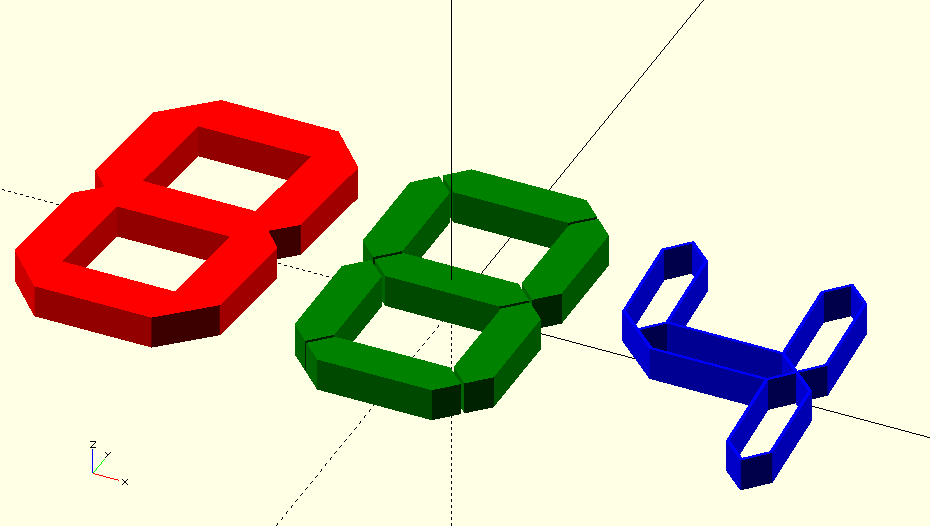

OpenSCAD 7 Segment Library
==========================

To use this module, copy `7seg.lib.scad` in your project folder or library folder (File - Show Library Folder) and place `"use <7seg.lib.scad>"` in your code.
Then call `digit_outline()` etc., see examples.

Open `7seg.lib.scad` in OpenSCAD for more examples.

Get OpenSCAD at https://www.openscad.org/

You can create 7 segment modules in different sizes, skew angle, 3D (for printing) or 2D (for cutting, silkscreen etc...)

Example:
--------
```
digit_hull(60,100,12,1,10,5,1);
    
digit_inner(60,100,12,1,10,0,1);
    
digit_outline(60,100,12,1,10,-5,1,[1,2,3,5]);
```
